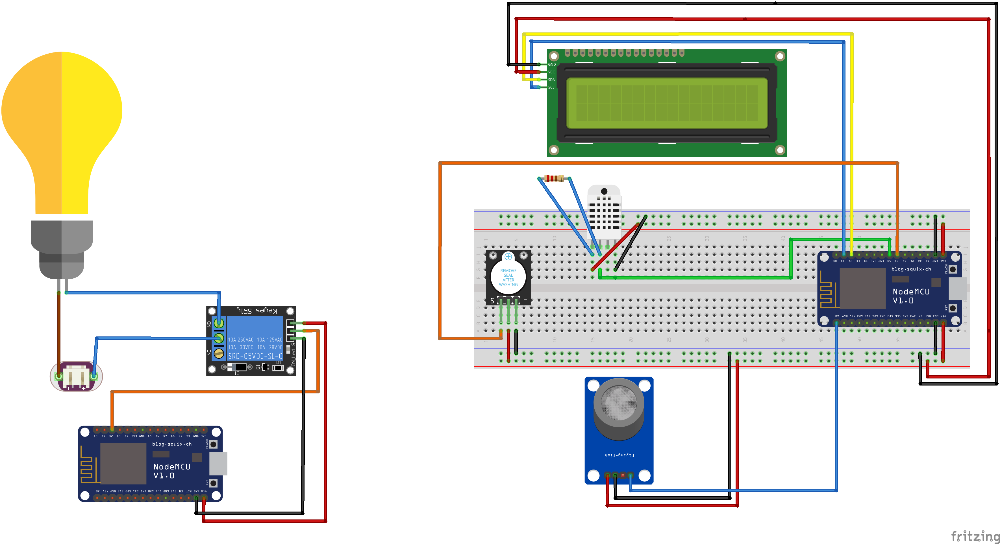

# IoTapp
Angular WEB app connected with Firebase to control smart home system based on ESP8266 

Electrical circuit of system:

Hardware:
 - ESP8266 + NodeMCU v3
 - DHT22
 - LCD 2x16 +  I2C LCM1602
 - MQ-2 + buzzer
 - Relay
 - MB102

Main screen with nav bar:
