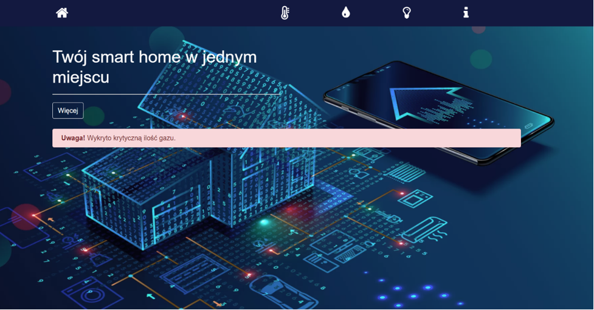
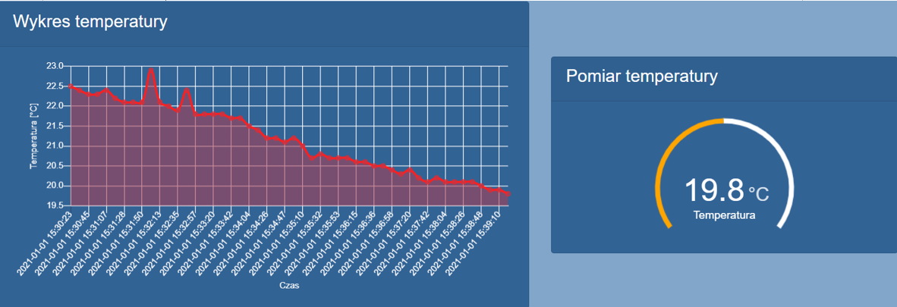
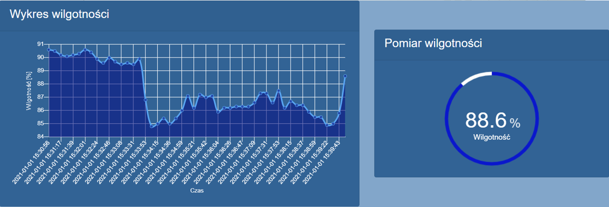
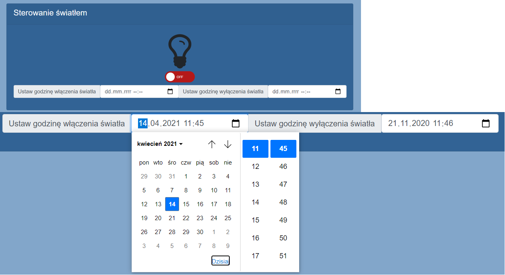

# IoTapp
Angular WEB app connected with Firebase to control smart home system based on ESP8266 

Electrical circuit of system:

Hardware:
 - ESP8266 + NodeMCU v3
 - DHT22
 - LCD 2x16 +  I2C LCM1602
 - MQ-2 + buzzer
 - Relay
 - MB102

Main screen - this is starting page of app, here you will be able to see alert if sensor detects gas:

Temperature screen - this is screen showing plot of temperature in time and also last measurement of temperature:

Humidity screen - this is screen showing plot of humidity in time and also last measurement of humidity:

Light control screen  - this is screen at which user is able to control light i.e. turn it on/off or set a time in future at which light will be turned on/off.

